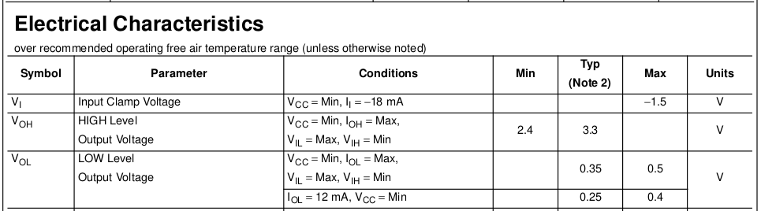
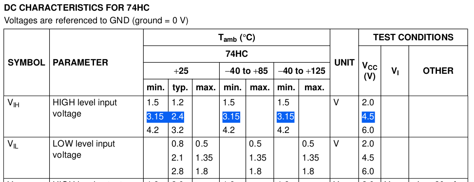
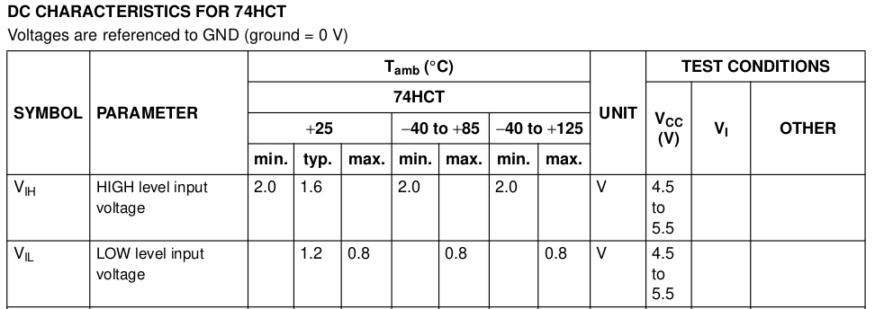
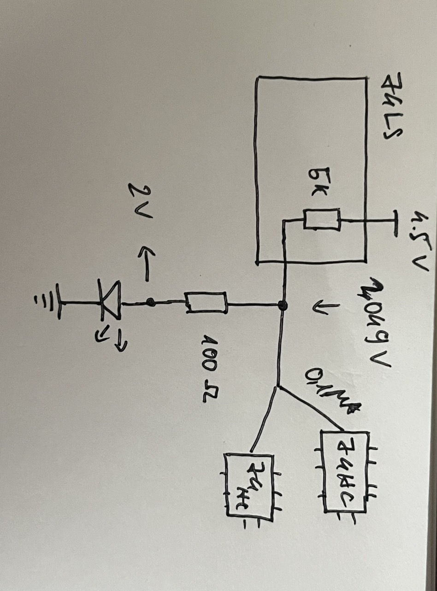

# Những thứ bạn có thể tìm thấy trong trang này
- Phân biệt 74ls 74hc 74hct family.
- Những chú ý khi sử dụng phối hợp 2 dòng IC LS, HC trong một project.
- Những chân IC không sử dụng thì làm gì với nó?
- Bạn thắc mắc gì?
## Phân biệt 74ls 74hc 74hct
- LS : low-power Schottky ( TTL chips )
- HC : high-speed CMOS ( CMOS chips )
- HCT : compatiple high-speed CMOS ( CMOS chips )
## Chú ý khi sử dụng phối hợp dòng IC LS, HC (LS sử dụng công nghệ TTL, và HC sử dụng công nghệ CMOS!)
- `TTL` chips có output tối thiểu khoảng 2.4V, thường sẽ cao hơn một chút tầm 3.3V khi được cấp Vcc = 4.5V
Ảnh dưới đây là datasheet của ic 74LS574

- `CMOS` chips có input mức `HIGH` cao khoảng 3.15V (tối thiểu phải cấp vào 3.15V để đảm bảo mức tìn hiệu `HIGH` ở chân này) khi được cấp Vcc = 4.5V
Ảnh dưới đây là datasheet của ic dòng 74HC

**Ví dụ**: Sử dụng `LS` output để cấp tín hiệu mức `HIGH` cho `HC` input thì có thể IC sẽ hoạt động không đúng vì output mức `HIGH` của `LS` theo datasheet thì là 2.4V - 3.3V có thể không đủ cấp tín hiệu `HIGH` cho `HC` với yêu cầu tối thiểu phải đảm bảo 3.15V, khiến chức năng của `HC` có thể sai (phải cẩn thận nếu có sử dụng mix cả 2 dòng IC trong quá trình thiết kế). 
Cách giải quyết chính là sử dụng dòng IC `HCT`. Dòng IC này đưược thiết kế để sử dụng phối hợp với dòng `LS`. Điện áp cấp vào input để IC dòng `HCT` nhận tín hiệu mức `HIGH` tối thiểu yêu cầu 2V, thấp hơn dòng `HC`, và nó có thể hoạt động bình thường với output của dòng LS.

Ngược lại nếu sử dụng tín hiệu output của dòng `HC/HCT` để điều khiển input của dòng `LS` thì hoạt động hoàn toàn bình thường, bạn có thể đọc datasheet để kiểm chứng lại.
(Với điều kiện cả 2 con IC đều dùng chung một mức điện áp `Vcc`, khác mức điện áp nguồn thì có thể ngưỡng `HIGH` của chúng sẽ khác nhau, phụ thuộc vào datasheet). Lấy ngay ví dụ datasheet của dòng `74HC` dưới đây bạn sẽ để ý thấy khi cấp Vcc = 6V thì điện áp tối thiểu để đảm bảo IC nhận tín hiệu `HIGH` phải là 4.2V.

- **Chú ý**: trên thực tế, nếu bạn kiểm thử bằng cách sử dụng (nguồn 4.5V, tín hiệu output của IC `LS` dùng để điều khiển tín hiệu mức `HIGH` của IC dòng `HC`)  có thể vẫn hoạt động bình thường =)))
Mình sẽ giải thích sơ qua về điều này: Một ví dụ về hoạt động của chân output mức `HIGH` của IC dòng `LS`, trường hợp xấu nhất có thể chịu được 10 `LS` loads (tức là output cắm cùng lúc cho 10 con IC dòng `LS`), tương đương với khoảng 400 con `HC` loads (bạn có thể tìm hiểu thêm về keyword "`fanout`"). Khi full loads thì đầu ra output mức `HIGH` của dòng `LS` này mới tụt xuống khoảng ~2.4V (và register là lí do mà output của dòng `LS` bị sụt điện áp), khi đó thì lí thuyết ở trên mình vừa nêu mới xảy ra, tuy nhiên trong thực tế, nếu kết nối output của IC dòng `LS` vào IC dòng `HC` thì rất khó để có thể đạt tới ngưỡng `fanout` vì ở trên mình có nói là có thể kết nối cùng lúc khoảng 400 con `HC`, vì vậy khi chỉ sử dụng output cho một vài con IC thì điện áp output của dòng `LS` có thể vẫn nằm trong khoảng 3.3V - 4V. Vì vậy chúng vẫn hoạt động bình thường và chạy đúng.
**Vậy câu hỏi đặt ra là**: nó hoạt động bình thường thì nãy giờ mình nói có ý nghĩa gì :)) Nếu các bạn chỉ dùng tín hiệu output của IC dòng `LS` cho các IC khác thì có thể điều này vẫn ổn, cho đến khi bạn sử dụng thêm output này cho một linh kiện khác ví dụ đèn led. Mình sẽ lấy ví dụ về tính toán số liệu cho dễ hiểu:

- Nếu không có điện trở 100 Ohm và đèn led, 2 IC dòng `HC` chỉ thất thoát khoảng 0.1 uA mỗi con, vì vậy sự sụt áp là không đáng kể, nên mạch của chúng ta vẫn hoạt động bình thường.

- Khi có thêm một con đèn led nối tiếp 1 con điện trở thì chuyện sẽ khác. Ngay lập tức output của IC dòng `74LS` chỉ còn 2.049V (áp dụng voltage divider để tính toán), với mức điện áp này thì 2 con IC dòng `HC` sẽ không thể đảm bảo nhận đúng tín hiệu `HIGH`, sẽ nhận được kết quả không mong muốn.

**Vậy nên**, tốt nhất là sử dụng một dòng IC, còn nếu bắt buộc phải sử dụng cả 2 dòng IC, thì hãy đảm bảo bạn kiểm soát được chúng trong quá trình sử dụng. 
## Những chân IC không sử dụng thì làm gì với nó?
- Không nên bỏ trống (thả nổi, float) những chân như vậy. Nó sẽ gây tiêu tốn nhiều năng lượng, những chân có mức logic ổn định `HIGH` hoặc LOW sẽ tiêu tốn ít năng lượng hơn. Những chân như vậy cũng có thể làm cho IC hoạt động không đúng như chức năng mô tả. Nếu nhìn thấy IC hoạt động không như mong đợi, hãy cắm hết chân cho chắc ăn :v
- Tuy nhiên với `TTL` input khi bỏ trống, thì nó vẫn hoạt động bình thường, và chân đó sẽ nhận tín hiệu mức `HIGH`.
- Với `CMOS` input thì bắt buộc phải kết nối chúng, không được bỏ trống, dù có sử dụng chân đó hay không
    - Vì dòng `CMOS` có impedance rất cao, chỉ một lượng điện tích rất nhỏ cũng có thể làm chúng thay đổi trạng thái, vì vậy dẫn đến chúng hoạt động không đúng. Hãy thử chạm tay của bạn vào input của dòng này sẽ rõ:v
    - Nếu thả nổi những chân này, có những trường hợp điện áp ở chân này chúng ta không thể dự đoán trước:
    
    Đây là cổng NOT sử dụng công nghệ `CMOS`, nếu như chân input `A` được thả nổi, trong trường hợp điện áp ở chân này ở ngưỡng mà  cả 2 transistor đều hoạt động thì dẫn đến đoản mạch, làm cho IC nóng lên, tiêu tốn năng lượng và có thể làm hư IC.

## Câu hỏi bạn có thể thắc mắc
- Keyword `fanout` trong bài mình đề cập là gì?

